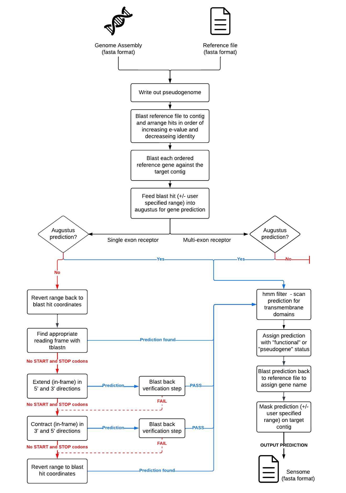

<!--\-->


<!--\-->


<!--\# Sensommatic: Sensory Receptor Gene Mining Tool\-->

<hr>

### <ins>Overview:</ins>

<!--\-->

Sensommatic implements blast and augustus to mine and predict sensory receptors from your genome of interest. 

<!--\-->


#### <li>Input files:</li>
<ol type="1">
<li>  Genome assembly file (fasta format) </li>
<li>  Reference receptor file (fasta format) </li>
</ol>

#### <li>Output files:</li>
Sensory receptor predictions for query genome (fasta format)

<br>

### <ins>Dependencies:</ins>

<ol type="1">

#### <li> BLAST:</li>
Sensommatic requires BLAST to mine sensory receptors from your genome of interest. <br>

<b>Quick install with root privilages:</b>
```
sudo apt-get update
sudo apt-get -y install ncbi-blast+
```
<b>Install BLAST from source:</b> <p>
https://ftp.ncbi.nlm.nih.gov/blast/executables/blast+/LATEST/

 <br>
 
#### <li>AUGUSTUS:</li>

Sensommatic uses augustus to predict the gene structure of each sensory receptor.

<b>Quick install with root privilages:</b>
```
sudo apt-get update
sudo apt-get install augustus
```

<b> Install AUGUSTUS with conda: </b>
```
conda install -c bioconda augustus
```

<b>Install AUGUSTUS from source </b></p>

Augustus dependencies: https://github.com/Gaius-Augustus/Augustus/blob/master/docs/INSTALL.md <p>
Build augustus: https://github.com/Gaius-Augustus/Augustus <p>

Make sure to set your AUGUSTUS_CONFIG_PATH variable by appending the following to your ~/.bashrc file: <p>
```
export AUGUSTUS_CONFIG_PATH=/my_path_to_AUGUSTUS/Augustus/config/    #where my_path_to_AUGUSTUS is dependent on where you cloned the augustus repo
```
Troubleshooting:
If you have trouble installing augustus from source, try setting the ZINPUT and COMPGENEPRED variables in the common.mk file to false.
 
 <b> Blat2hints:</b>
 
 Sensommatic requires the blat2hints.pl script from augustus. 
 
 Please dowload the script from the augustus github page as linked below, and place the script in your working directory.
 https://github.com/nextgenusfs/augustus/blob/master/scripts/blat2hints.pl 
 
 <br>
 
#### <li>BLAT:</li>
Augustus requires blat to generate hints from the reference file. Follow instructions here: <p>
https://bioinformaticsreview.com/20200822/installing-blat-a-pairwise-alignment-tool-on-ubuntu/ 
 
<br>

#### <li> HMMER and easel miniapps :</li>

To install hmmer and easel miniapps, please follow the instructions from the hmmer manual (pgs 17-18):

Manual:
http://eddylab.org/software/hmmer/Userguide.pdf

<br>
</ol>
 
### <ins>Running Sensommatic:</ins>
To run Sensommatic, you must include the following files in your working directory:

<ul>
<li> sensommatic.pl
<li> Reference file (see below)
<li> blat2hints.pl
<li> ProfileHmms.hmm
</ul>

Once you have specified your reference file and augustus species (see options and parameters section below), you can run sensommatic using the following command:

```
perl sensommatic.pl genomefile.fna >> outputfile.fa
```
<br>

### <ins>Pipeline description:</ins>
<br>
</p>




</p>

<br>

### <ins>Options and parameters:</ins>
Sensommatic has many options and parameters that can be adjusted by the user. To change parameters or options, open sensommatic in your text editor of choice and change the parameters value. See variable names and description for each pameter/options below. 

<br>
<ol type="1">
<b>
<li> Reference file: </p>
</b>
The user should chose the most appropriate reference file for their query species. The reference file can be specified in line 13 of the code as such:</p>

```
my $receptorfile="MammalReceptors.fa"; #line 13
```
See reference file names for each class of vertebrates below:
</p>
<table>
  <tr>
    <th>Vertebrate class</th>
    <th>Reference file</th>
  </tr>
  <tr>
    <td>Mammal</td>
    <td>MammalReceptors.fa</td>
  </tr>
  <tr>
    <td>Amphibian</td>
    <td>AmphibianReceptors.fa</td>
  </tr>
    <tr>
    <td>Reptile</td>
    <td>ReptileReceptors.fa</td>
  </tr>
    <tr>
    <td>Bird</td>
    <td>BirdReceptors.fa</td>
  </tr>
  <tr>
    <td>Fish</td>
    <td>FishReceptors.fa</td>
  </tr>
</table>
</ul>
<br>

<b>
<li> Augustus Species: </p>
</b>
The user should chose the augustus species which is most closely related to their query species. For example, for mammals the augustus species would be specified as such:</p>

```
my $augustus_species = "human"; #line 14
```
See available augustus species and their identifiers in the table below:

<table>
  <tr>
    <th>Identifier</th>
    <th>Species</th>
    <th>Class</th>
  </tr>
  <tr>
    <td>human</td>
    <td>Homo sapiens</td>
    <td>Mammal</td>
  </tr>
  <tr>
    <td>chicken</td>
    <td>Gallus gallus</td>
    <td>Bird</td>
  </tr>
    <tr>
    <td>zebrafish</td>
    <td>Danio rerio</td>
    <td>Fish</td>
  </tr>
    <tr>
    <td>lamprey</td>
    <td>Petromyzon marinus</td>
    <td>Fish</td>
  </tr>
</table>

</ul>
<br>
<b>

<li> General options: </p>
</b>
There are a number of options that the user can chose to customise: 

<b>Masking region:</b> This value is the range that predictions are masked at the 5' and 3' ends of prediction. This feature reduces occurance of single loci being reported as two predictions. By default, the masking range is set to 750 nucelotides.

```
my $block_region = 750; #line 21
```
</p>
<b>BLAST threads:</b> This is the number of threads that BLAST can use. By default this value is set to 8 threads. Please change this to suit your computer.

```
my $threads=20; #number of threads for blast #line 22
```
<b>HMMER filter:</b> Sensommatic will scan each prediction to search for transmembrane domains using HMMER. Predictions lacking any transmembrane domains are filtered out. By default this feature is turned on. The user may chose to turn this feature off.

```
my $hmm_filter = "yes"; #line 23
```
</p>
<b>Remove duplicate values:</b> By default, sensommatic will report sequences which share 100% identity. Duplicated sequences may be removed by setting the below variable to "no". Setting this value to "no" will remove duplicate sequences which may have arisen due to assembly error. Removing duplicate sequences may however miss true recent duplication events if no sequence divergence has occured between paralogues (100% identical).

```
my $keep_same_seq= "yes"; #line 24
```
</p>
<b> Pseudogenome option:</b> If this option is set to "yes", sensommatic will write out contigs which have significant receptor hits to generate a 'pseudogenome'file. This feature will improve run-times significantly. Rarely, you may encounter issues with BLAST maxing out on memory if this step is turned on. If your genome is significantly large, and you encounter issues with maxing out on memory, try setting this option to "no". 

```
my $pseudogenome_option = "yes"; #line 25
```
</p>
<b> Esl-sfetch option:</b> If the above pseudogenome_option is turned on, and this esl-sfetch option is set to "yes", sensommatic will write out contigs using the hmmer esl-sfetch tool. This option requires that the hmmer esl miniapps suits is installed. Setting this to "yes" will improves speed and will not impact or alter predictions.

```
my $pseudogenome_esl = "yes"; #line 26
```
</p>
<b> Repeat predictions at difficult regions:</b> By default, sensommatic will mask regions in which no viable prediction was generated. The user may chose to enable repeat predictions to increase the chance of prediction. Turning this feature on will signifigantly increase pipeline run time. To turn this feature on, set the below variable to 1.

```
my $repeat_preds = 0; #line 27
```

</p>
<b> Remove intermediate files:</b> Sensommatic generates numerous intermediate files. By default, these intermediate files are deleted after completion. The user may chose to keep these intermediate files by settinhg the below variable to "no".

```
my $remove_intermediate= "yes"; #line 28
```
</p>
<b> Print start and end time stamps</b> By default, time stamps are not included in the output file. If you wish to include the pipeline start and end times in the final output file, set the below variable to "yes".

```
my $print_datestring = "no"; #line 29
```
</p>
<b> Minimum prediction length:</b> By default, predictions with lengths shorter than 200 nucleotides are excluded from the final output file. The user may chose to customise this value.

```
my $minlength=300; #line 30
```

</ul>
<br>
<b>
<li> Augustus parameters: </p>
</b>
The user may wish to change the range that is fed into augustus for gene prediction.

</p>
<b> Multi-exon range</b> By default, the region +/- 50 Kb upstream and downstream of the blast hit is fed into augustus for multi-exon gene prediction. The user may customise the range by changing the below variable. 
</p>

```
my $multi_exon_range = 50000 #line 33
```
</p>
<b> Single exon range:</b> By default, the region +/- 2500 bp upstream and downstream of the blast hit is fed into augustus for single exon gene prediction. The user may customise the range by changing the below variable. 

```
my $single_exon_range = 2500; #line 34
```

</ul>
<br>
<b>
<li> BLAST parameters: </p>
</b>
The user may chose to change the thresholds that each blast hit must reach to be considered for prediction.
</p>
<b>Cover threshold:</b> This is the minimum coverage required for blast hits to be considered. Coverage corresponds to the number of nucleotides aligned between the reference gene and the target hit.

```
my $cover_threshold = 300; #line 37
```

</p> 
<b>Identity threshold:</b> This is the minimum percentage identity required for blast hits to be considered. Percentage identity corresponds to the percentage of identical nucleotides in the aligned region between the reference gene and the target hit.

```
my $identity_threshold = 70; #line 38
```

</p> 
<b>E-value threshold:</b> This is the evalue threshold required for blast hits to be considered. Hits with e-values greater than this value will not be considered.

```
my $evalue_inclusion = "1e-30"; #line 39
```

</p>
<b>Percentage cover threshold:</b> Blast enables hits to be filtered by percentage cover. By default, single exon hits which cover less than 30% of the reference gene filtred out. Decreasing this value will increase run-times.

```
my $qcov =30; #line 40
```
</ul>
<br>
<b>
<li> Pseudogene length parameters: </p>
</b>
Sensommatic will assign pseudogene and functional status based on in-frame stop codons and prediction length. The user may chose to customise the length below which genes are considered as pseudogenes.

</p>
<b>Single exon pseudogene length:</b> This is the length below which single exon predictions will be labelled as 'pseudogene'.
</p>

```
my $single_exon = 860; #line 44
```

</p>
<b>Opsin (multi-exon) pseudogene length:</b>  This is the length below which opsin predictions will be labelled as 'pseudogene'.
</p>

```
my $opsin_multiexon = 1000; #line 44
```

<b>TAS1R (multi-exon) pseudogene length:</b> This is the length below which type II taste receptor predictions will be labelled as 'pseudogene'.
</p>

```
my $taste_multiexon = 1000; #line 45
```


<b>VN2R (multi-exon) pseudogene length:</b>  This is the length below which type II vomeronasal receptor predictions will be labelled as 'pseudogene'.
</p>

```
my $vomeronasl_multiexon = 2000; #line 46
```


</ul>
<br>
<b>
<li> Sensommatic parameters: </p>
</b>
Single exon hits in which augustus fails to produce a gene prediction will enter the sensommatic extension and internal searches for start and stop codons. The below parameters apply only to single exon genes, where no augustus prediction was generated.

</p>
<b>Maximum extension length:</b>  If the blast hit is missing start or stop codons, this is the length that the sequence can expand to when searching for the start and end positions.
</p>

```
my $max_length_external = 1300; #line 49
```

<b>Minimum internal contraction length:</b>  If the blast hit is missing start or stop codons after the extension search, this is the length that the sequence can contract to when searching internally for the start and end positions.
</p>

```
my $min_length_internal  = 500; #line 50
```

<b>Family specific extension lengths:</b>  The user may opt to assign default extension lengths for each single exon receptor gene family. By defult this option is turned off. To turn this option on, set the below variable to 1.
</p>

```
my $type_length_switch = 0; #line 51

#external extension limit: Olfactory Receptors
my $OLFR_max_length = 1300; #line 52

#external extension limit: Trace amine associated receptors
my $TAAR_max_length = 1300; #line 53

#external extension limit: Taste receptors
my $TASR_max_length = 1300;  #line 54

#external extension limit: Vomeronasal receptors
my $VOMR_max_length = 1300; #line 55

```
<b>Initial contraction:</b> Prior to the extension searches, sensommatic will perform an initial contraction of 25% (12.5% either end). This improved prediction accuracy. The user may chose to customise the value by setting the velow variable.
</p>

```
my $percent = 0.25; #line 56
```

</ul>
<br>
<b>
<li> Blastback parameters: </p>
</b>
Single exon hits which enter the sensommatic extension or contraction search features are verified at each step in a 'blastback' verification step. The below parameters relate only to single-exon genes in which augustus failed to produce a prediction.
</p>
<b>Blastback verification:</b> The user may chose to turn off the blastback verification steps by setting the below variable to 0.
</p>

```
my $blastback_verification = 1; #line 59
```

<b>Percentage cover threshold:</b> This is the percentage cover shared between the prediction and the reference gene. By default, predictions which share 60% cover are considered valid. 
</p>

```
my $percentage_cover_threshold = 0.6 #line 60
```

<b>Percentage identity threshold:</b> This is the percentage identity shared between the prediction and the reference gene. By default, predictions which share 50% identity are considered valid. 
</p>

```
my $percentage_identity_threshold = 0.5; #line 61
```

<b>E-value threshold:</b> This is the evalue threshold required for predictions to be considered valid post extension or contraction. Hits with e-values greater than this value will not be considered.
</p>

```
my $evalue_threshold ="1e-30"; #line 62
```

<b>Blast-back scores:</b> The user may chose to include blast-back verification scores in the prediction fasta headers. By default, this feature is turned off. To turn the feature on, set the below variable to 1.
</p>

```
my $include_score = 0; #line 63
```

</ul>
<br>
<b>
<li> Annotation options: </p>
</b>
Sensommatic annotates predictions as "functional" or "pseudogene" based on in-frame stop codons. The user may customise how these predictions are labelled by altering the below variables for each condition.
</p>

<b>Annotations: Functional vs Pseudogene </b> 
</p>

```
#If prediction is shorter than pseudogene length specified above
my $annotation_short = "pseudogene_short"; #line 66

#START codon and no in frame stop codons
my $annotation_1 = "functional"; #line 67

#no START codon and no stop codons in any frame
my $annotation_2 = "functional"; #line 68

#no START codon and no in frame stop codons
my $annotation_3 = "functional"; #line 69

#START codon and in frame stop codon
my $annotation_4 = "pseudogene_nonsense"; #line 70

#no START codon and stop codons in all frames
my $annotation_5 = "pseudogene_nonsense"; #line 71

#no START codon and in frame stop codon
my $annotation_6 = "pseudogene_nonsense"; #line 72
```

<b>Truncated predictions:</b> By default, sensommatic will assign predictions which are missing stop codons as "truncated". The user may chose to turn this option off by setting the below variable to 0.
</p>

```
my $truncated = 1; #line 75
```

<b>Truncated annotation:</b> By default, sensommatic will assign predictions which are missing stop codons as "truncated". The user may chose to change this label by customising the below variable.
</p>

```
my $annotation_truncated = "truncated" #line 76
```
</p>
